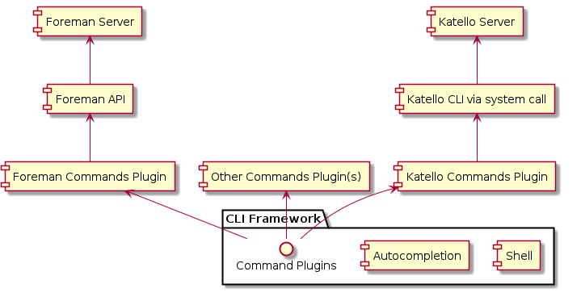

Hammer - the CLI tool for foreman
=================================

As the diagram shows, the CLI consist of almost generic framework (shell-like environment, autocompletion, command help text, option evaluation and command invocation) and set of plugins defining the actual commands. This setup is flexible and allows us to easily install different sets of commands for different products. The plugins are independant and can implement any action as an command, so that besides commands calling Foreman API you can have commands calling varius admin tasks, etc.

The CLI has

 - Git-like subcomands
 - system shell autocompletion for commands and options
 - shell-like environment with autocompletion and history where the commands can be run directly
 - commands extensible via plugins
 - been implemented in Ruby
 

If you are interested you can help us by sending patches or filing bugs and feature requests (there is CLI catgory in Redmine)

How to run
----------

The work is in progress and there are still no builds ready, but instaling from sources is easy. You will need rake, bundler.
Clone and install CLI core

    $ git clone git@github.com:theforeman/hammer-cli.git
    $ cd hammer-cli
    $ rake install
    $ cd ..

clone plugin with foreman commands

    $ git clone git@github.com:theforeman/hammer-cli-foreman.git
    $ cd hammer-cli-foreman
    $ rake install
    $ cd ..
    
and configure. Configuration is by default looked for in ~/.foreman/ or in /etc/foreman/. 
Optionally you can put your configuration in ./config/ or point hammer 
to some other location using -c CONF_FILE option

You can start with config file template we created for you and update it to suit your needs. E.g.:

    $ cp hammer-cli/config/cli_config.template.yaml ~/.foreman/cli_config.yml

and run 

    $ hammer -h
    Usage:
        hammer [OPTIONS] SUBCOMMAND [ARG] ...

    Parameters:
        SUBCOMMAND                    subcommand
        [ARG] ...                     subcommand arguments

    Subcommands:
        shell                         Interactive Shell
        architecture                  Manipulate Foreman's architectures.
        compute_resource              Manipulate Foreman's architectures.
        domain                        Manipulate Foreman's domains.
        organization                  Manipulate Foreman's organizations.
        subnet                        Manipulate Foreman's subnets.
        user                          Manipulate Foreman's users.

    Options:
        -v, --verbose                 be verbose
        -u, --username USERNAME       username to access the remote system
        -p, --password PASSWORD       password to access the remote system
        --version                     show version
        --autocomplete LINE           Get list of possible endings
        -h, --help                    print help

How to test
------------

Development of almost all the code was test driven.

    $ bundle install
    $ bundle exec "rake test"

should work in any of the cli related repos. Generated coverage reports are stored in ./coverage directory.

Acknowledgements
----------------

Thanks to Brian Gupta for the initial work and a great name.
